Jade for CS210 
=====

Welcome to Jade! Your CS210 experience this semester leverages the capabilities of the Jade design enviornment to create schematics to help better understand the intracacies of processor architectures. This document serves as a reference guide to understand the functionality of the tools provided as well as a troubleshooting guide for frequent problems encountered in prior semesters.

This is a working document and will be updated as new functionality is added and when newer common issues are diagnosed and resolved.

## Table of Contents

1. [The Tools](#The-Tools)
   - [File Tools](#file-tools)
   - [JSON File Switcher](#json-file-switcher)
   - [Views](#views)
   - [Schematic Tools](#schematic-tools)
   - [Schematic Testing / Saving Tools](#schematic-testing--saving-tools)
   - [Schematic Viewer Tools](#schematic-viewer-tools)
2. [How to Do Stuff on Your Server](#how-to-do-stuff-on-your-server)
   - [Starting The Server](#starting-the-server)
      - [A Note About The Client-Server Model](#a-note-about-the-client-server-model)
   - [Creating Your First Schematic](#creating-your-first-schematic)
   - [Special Inputs](#special-inputs)
   - [Handling Multi-Bit Values](#handling-multi-bit-values)
   - [Switching JSON Files](#switching-json-files)
   - [Stopping The Server](#stopping-the-server)
3. [Troubleshooting](#troubleshooting)
   - [Python Program Errors](#python-program-errors)
   - [Jade Errors](#jade-errors)

## The Tools
### File Tools
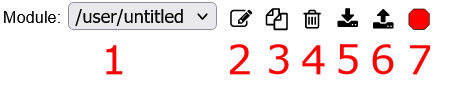
1. **Module Select**: Switch between various modules in the current state / JSON.
2. **Edit/Create Module**: After being prompted, enter a previously unused module name to create a new module. Alternatively, enter an existing module name to switch to that module. 
   - If the provided module name does not start with "/", the module name is assumed to start with "/user/". In other words, if you enter "mymodule" as the desired module, you will go to module "/user/mymodule"
3. **Copy Module**: Create a duplicate of the current module. You will need to specify the name of the new module when prompted.
4. **Delete Module**: Deletes the current module.
5. **Save Modules to Clipboard**: Save current modules to the clipboard. This feature is not likely to be used in CS210.
6. **Load Modules from Clipboard**: Load previously saved modules to the clipboard. This feautre is not likely to be used in CS210.
7. **Stop Server**: Terminate the server hosting the Jade web server.

### JSON File Switcher

- Some assignments in CS210 may ask you to work with multiple JSON files. You may utilize the built-in JSON switcher in the user interface to switch between different files. Upon choosing a file, your interface should refresh and load the contents of the new JSON file.

- **IMPORTANT: All JSON files being used with Jade should be stored in the same directory where Jade's files are located. In addition, avoid using JSON files not intended for use with Jade. Failure to do so may lead to unexpected behavior.**

### JSON Backups

- In addition to the automatic file saving features of Jade, in case something goes wrong or you want to go back to an earlier point, you can enable this feature to have Jade start saving copies of your current save state that will be stored in an `autosaves` directory, with the filename containing the filename of the current JSON file as well as the date and time the backup was created.

- In its current implementation, there is a maximum of 5 backups of each JSON file, with rolling backups occurring every 5 minutes. If there already exists 5 backups, the oldest file will be deleted to make space for the new backup.

- This feature is **enabled** by default, but can be turned off at any time if you prefer.

### Views

- **Schematic**: Your main working area, this is where you can utilize analog and gate devices to build your circuits.
- **Icon**: This is where you can modify what your completed module looks like and how it looks in other modules.
- **Properties**: Fine-tune parameters of the Jade tool here. Not likely to be used for CS210 assignments.
- **Test**: This is where you can view and/or edit the tests for the currently selected module.

### Schematic Tools
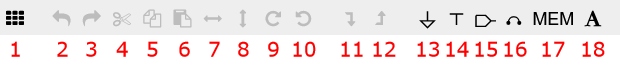
1. **Grid**: Enable/Disable the grid overlay.
2. **Undo**: Reverts the previous action.
3. **Redo**: Performs the operation that was previously undone.
4. **Cut**: Remove the selected element(s) from the schematic and save it to the clipboard. Can also use Ctrl-X or Cmd-X.
5. **Copy**: Save the selected element(s) from the schematic to the clipboard. Can also use Ctrl-C or Cmd-C.
6. **Paste**: Add the saved element(s) from the clipboard to the schematic. Can also use Ctrl-V or Cmd-V.
7. **Horizontal Flip**: Flip the currently selected element(s) horizontally.
8. **Vertical Flip**: Flip the currently selected element(s) vertically.
9. **Rotate Clockwise**: Rotate the currently selected element(s) 90 degrees clockwise.
10. **Rotate Counterclockwise**: Rotate the currently selected element(s) 90 degree counterclockwise.
11. **Move Down in Hierarchy**: For supported schematics, move the selected element(s) down/backwards in the hierarchy.
12. **Move Up in Hierarchy**: For supported schematics, move the selected element(s) up/forwards in the hierarchy.
13. **Ground Connection**: Add a new ground connection element to the schematic. Can also use [GND](#special-inputs) equivalent.
14. **Power Supply Connection**: Add a new power supply connection to the schematic. Can also use [VDD](#special-inputs) equivalent.
15. **Input/Output Port**: Add a new input/output element to the schematic.
16. **Jumper**: Add a new jumper element to the schematic.
17. **Multi-Port Memory**: Add a new Multi-Port Memory element to the schematic. Unlikely to be used in CS210 assignments.
18. **Text**: Adds a new text element to the schematic.

### Schematic Testing / Saving Tools
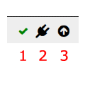

**IMPORTANT: All of the tools in this section that save files to the device will completely overwrite any existing file matching the file's name, so be sure to double check your files and make any copies as needed prior to performing the operation.**

1. **Test**: Run the current module's test and display the result of the test.
2. **Extract Netlist**: Exports the netlist of the current module to a file, typically formatted as `user-untitled-netlist.json` by default, where user-untitled represents module "/user/untitled". May be required for submitting some assignments in CS210.
3. **Save Module to File**: Save the current module to a file, typically formatted as `user-untitled-save.json` by default, where user-untitled represents module "/user/untitled". Useful for creating isolated copies of individual modules.
4. **Combine Modules**: Select one or more files and consolidate all of their modules into a new JSON file with a name of your choosing. Existing files are unchanged.

### Schematic Viewer Tools
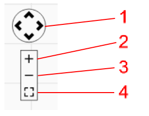
1. **Move**: Move the schematic viewer up, down, left, or right.
2. **Zoom In**: Zoom into the schematic viewer.
3. **Zoom Out**: Zoom out of the schematic viewer.
4. **Reset Zoom**: Reset the zoom level to 100%.

## How to Do Stuff on Your Server

If you're reading this message, then you've likely already completed the first step of downloading or cloning the repository from GitHub. If not, check out PS0B for instructions on how to download / clone this repository. With that, you should have all the files needed to get things started.

The only requirement is to make sure you have some version of Python 3 installed on your system in order to run the server. At time of writing, Python 3.13 is currently not supported with this program due to compatibility issues.

### Starting The Server
First things first: run the server.py python file. You can do this through a terminal (seen below) or pressing 'Run' in certain code editors and IDEs, such as Spyder or Visual Studio. From there, you'll be prompted to make two selections: 
1) the name of the JSON file to load (default: labs.json)
2) the number of the port to use (default: 8000)

**IMPORTANT: Make sure your JSON file is in the same directory as all of your Jade files, otherwise the program will not be able to find it. Avoid using JSON files not intended to be used with Jade.**

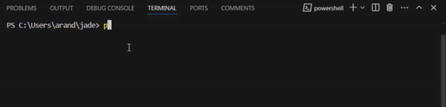

If prompted with a pop-up requesting you to allow Jade access through a firewall or network security system, you should allow access to be granted. Otherwise, the server may be inaccessible to you.

Once everything's ready to go, you can access the server through any web browser of your choosing, such as Google Chrome, Mozilla Firefox, or Microsoft Edge, with the link presented upon the server starting up. 

In addition, it's always a good idea to check on the Python terminal where you host the server occasionally, especially when dealing with [file saving](#schematic-testing--saving-tools) operations to ensure everything went smoothly and no errors appear. On rare occassions, the output produced by the web interface doesn't quite match up with what the python server is saying. If you end up in this scenario, you should trust the python server's response.

#### A Note About The Client-Server Model

You might be asking yourself "what's going on here?".

This is a very simple example of a client-server model, a common method of sending information between two or more devices. In this model, a client sends requests (and optionally, a data "payload") from your web browser to the server, indicating what kind of processing you want the server to do or what kind of information you want to retrieve from it. For Jade, this includes requests such as fetching the current state, updating the current state, creating a netlist/save file, etc. 

Once a request is received and is ready to be processed by the server, it will perform the necessary processing and return a response to the client, typically with a response code and possibly additional information. For Jade, this might include fetching the current state from the disk and sending it to the client, or creating a new file on the disk from information provided by the client. 

Check out [this](https://http.cat/) link for some fun cat images and an explanation as to what many of the HTTP status codes mean. Furthermore, see the below diagram that highlights how the client-server model operates.

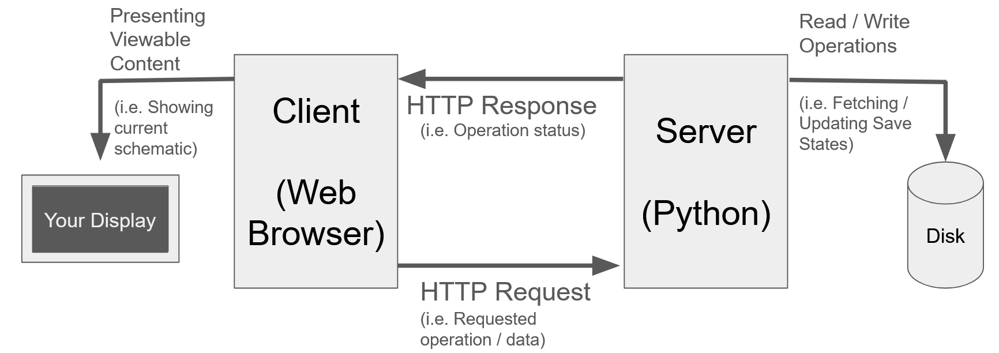

### Creating Your First Schematic

Most elements, such as I/O ports, gates, etc., can be brought into a schematic by drag-and-dropping them into the schematic. You can adjust certain attributes of those elements, such as their names, by double-clicking those elements. You can connect various elements together by clicking on one of the element's connection points and dragging the mouse over to another connection point. You can also drag the mouse to an empty area to create an additional connection point that allows you to make more complex connections and also to create neater bends in the wires.

Note, for various assignments in CS210, you may need to name the inputs/outputs a certain way. This is so the test for the module knows where to send input signals and to collect data from the designated outputs. It may also be helpful to name the gates in some circumstances to make debugging easier.

**IMPORTANT: Good news! Despite what the help.html file in this repository suggests, changes to your schematics are saved after every edit! No need to worry about manually saving your files.**

See below for a visual tutorial utilizing an AND gate.

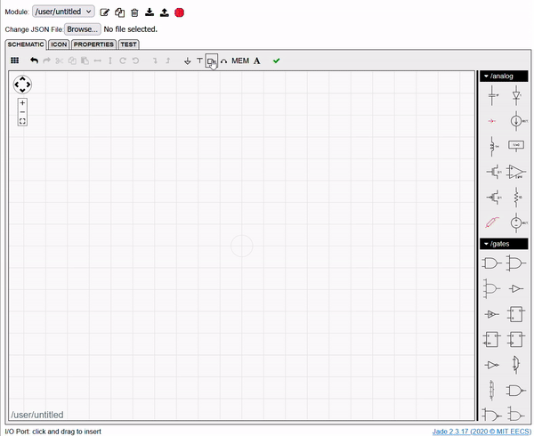

### Special Inputs

In addition to the specified inputs in test cases, there are certain inputs reserved by the Jade tool that may prove to be useful for certain assignments. A list of the available reserved inputs is shown below, just name your input accordingly and Jade should recognize it and act accordingly. 

- GND: A connection to ground, equivalent to inputting a 0 bit or using the [Ground Connection](#schematic-tools) tool.
- VDD: A connection to a power supply, equivalent to inputting a 1 bit or using the [Power Supply Connection](#schematic-tools) tool.

### Handling Multi-Bit Values

By default, all inputs are assumed to be one-bit values: 0s or 1s. Similarly, all output values by default are assumed to be a singular "L" for low or "H" for high (representing a binary 0 and 1 respectively). However, there are some cases where you'll need to work with multi-bit inputs and outputs. For instance, the test for a module may declare a 32-bit input, and your schematic will need to account for all 32 bits. 

Multi-bit functionality can be achieved by modifying the naming of various inputs and outputs. Assuming each input/output of a gate has the same number of bits, the gates will automatically duplicate to account for the increased bit width, so no need to rename the gates, but it may be helpful to double click on the connections between elements to specify the updated bit width. 

The exception to this is the multiplexer (mux), which requires a unique 1 or 2-bit 'select' input for a 2-way or 4-way multiplexer respectively (usually the connection on the bottom of the multiplexer). The select input is typically duplicated alongside the gate itself to match the bit width of the data inputs and the output. In other words, if you have a 4-way multiplexer with 32-bit data inputs, a 2-bit select input, and a 32-bit output, you should end up with 32 4-way multiplexer instances, where each instance has 1-bit data inputs, the original 2-bit select input, and 1-bit outputs.

Here's the rundown of how you can use the naming scheme to leverage this functionality...

- **Pound/Hashtag ( # ) Operator**: Repeats the provided input bits a specified number of times.
   - Example: Input#4. If Input is a 1, Input#4 would yield 1111.
   - In some cases, gates will automatically duplicate smaller bit-width inputs without the pound operator to match the other inputs/outputs, but it's best to be explicit to speed up the debugging process.
- **Comma ( , ) Operator**: Concatenates two values together in the order they are written. 
   - Example: InputA,InputB. Assuming 1-bit value InputA is 1 and 1-bit value InputB is 0, the resulting 2-bit value is 10.
- **Bracket ( [ ] ) Operator**: Creates a new multi-bit value. Generally used when the test passes in a multi-bit value as an input, when you only need to access a subset of a larger multi-bit value, or when you need to reverse the ordering of a multi-bit value.
   - Example: Input[31:0]. Represents a 32-bit value, where index 31 is the most significant / highest value bit.
   - Example: Input[0:31]. Represents a 32-bit value, where the order of the bits that was originally passed in gets reversed. Index 31, representing the most significant bit, is now the least-significant bit.

See below for an example leveraging multi-bit values featuring a NAND gate.

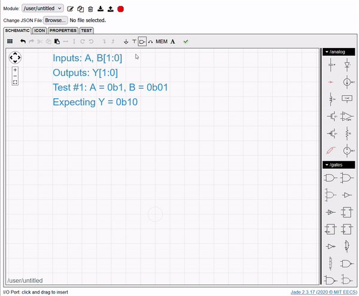

### Switching JSON Files

Sometimes, you'll need to work on different JSON files. Fortunately, it's a simple process to change this out. There are two methods that can be used:

1) Use the built-in JSON switcher (seen below)
2) Stop the python server and start it again, initializing it with the new JSON file name.

If using the built-in JSON switcher, you should also get a confirmation in the python program's output that looks like the following...

> INFO: Switching to JSON file yourNewFile.json

**IMPORTANT: Make sure the JSON file you select is in the same directory as the Jade files and is intended to be used with Jade. Choosing a file outside Jade's directory will create an error, and using a JSON not intended for use with Jade can lead to unexpected behavior.**

See below for a visual walkthrough.

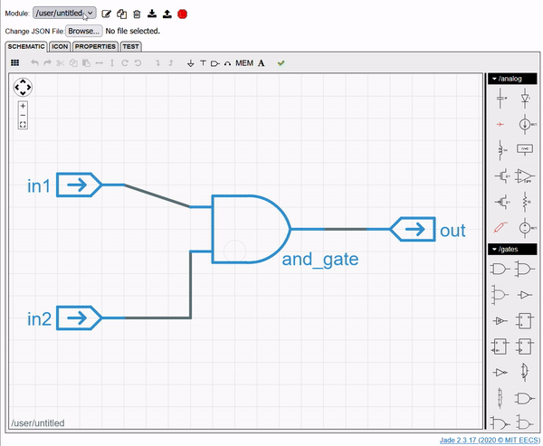

### Stopping the Server

Once you're done working with Jade, there are two options available in order to stop the server:

1) Use the shiny red [Stop Button](#file-tools) in the user interface (seen below)
2) Stop the python program directly with the 'stop' button in your editor or with the Ctrl-C / Cmd-C command in the terminal running the program.

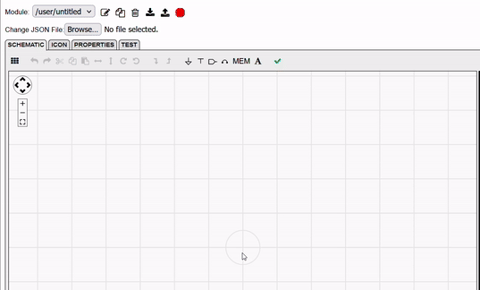

If using the user interface method, upon successfully terminating the server, you should see a confirmation on the webpage.

>  "Server successfully stopped. You may now close this window."

You should also observe your python program has stopped.

If either method does not work for whatever reason, you may close the terminal/window your python program is running from, but do note that your most recent edit(s) may not have been saved.

## Troubleshooting

Stuck on something? Is there a strange error message you're seeing? Look no further than this troubleshooting guide!

Do note, this software was developed on a Windows 11 device with additional testing done on an Ubuntu device and the WSL interface in Windows, so your error messages may vary slightly if running a Linux / MacOS device.

If you run into an issue not listed below, be sure to reach out to your course staff members in office hours or through the online forum (Piazza at time of writing).

### Python Program Errors
- "ConnectionAbortedError: [WinError10053] An established connection was aborted by software in your host machine"
   - This error message can be safely ignored. This is suspected to be due to adblock software in the browser or internal software in the host device, but testing seems to suggest the functionality of the program is not impacted.
- OSError: [WinError 10048] Only one usage of each socket address (protocol/network address/port) is normally permitted
   - One possible issue is that you already have a program (possibly Jade!) running on the specified port. Make sure to close out any existing programs running on the port before trying again, or alternatively, use another open port. Ports 3000, 8080, and 8000 are common, but most ports above 1024 are generally accessible to user programs.
   - Another known issue with Linux / WSL is that the python program handling the web server takes longer than ideal to exit. Fortunately, this python process seems to remove itself after a minute or two of waiting. Alternatively, if you're sure no other instances of Jade are running, you can run Jade on a different port without issue.
- ERROR: No JSON file found, are you sure you entered the correct name / directory?
   - The JSON file you specified does not exist in Jade's directory. Double check if you spelled the name of the file correctly or if the file is in Jade's directory (should be shown in the python program output in the line `INFO: Loading yourLab.json in directory /your/cool/directory`)
- ERROR: JSON file notajson.json is not formatted correctly. Please check the JSON file and try again.
   - The JSON file you specified was found in the correct directory, but the file doesn't appear to be in JSON format. Double check to see if you selected the correct file. If it is the correct file, then the file might have altered outside of Jade for some reason.
- ERROR: JSON file notajson.json is not formatted correctly. Keeping labs.json as the current JSON file
   - This error typically comes from using the JSON file switcher in the user interface. See the above issue for guidance.

### Jade Errors

- I can't see any of my gates on the right hand side!
   - This is a known issue with Jade's resizing mechanism. Fortunately an easy fix: Zoom in/out your browser window, even by just 10%. This should make the gates panel visible.
- Using Ctrl-C / Ctrl-V / Ctrl-X (or the Cmd equivalents) isn't working!
   - This is a known issue with Jade, where the keyboard shortcuts aren't recognized on occassion. Fortunately, using the provided Cut / Copy / Paste buttons in the toolbar should work without issue.
- Node is driven by multiple gates
   - This typically means there is a mismatch between the number of bits being used as an input/output. Make sure that all inputs/outputs of a gate have the same number of bits. It might also be helpful to change the bit width of the connections by double-clicking on the connections between inputs/outputs/gates and specifying the bit width manually.
- Node is not connected to any output, but is an input to the following devices
   - Typically, this error means that some gate/input is in use in your schematic, but never ultimately makes it to an output. Double check your connections with the involved nodes.
   - This issue may also appear if you connect an input directly to an output or have two or more connections stemming from a single output terminal of a gate, also known as a 'fanout.' We recommend removing these fanouts and instead creating duplicate input/output/gates where possible. For connecting inputs directly to outputs, place a buffer (the inverters without the circle in front) or a jumper (the squiggly line thing, next to the I/O port in the toolbar) in between them. The test will ensure the necessary data for an input goes to all instances of those input ports in your schematic.
- Number of connections for terminal X of submodule not a multiple of Y
   - Ideally, make sure all of your inputs/outputs for a gate/submodule have the same size / bit width, with the exception of multiplexers (though it does seem like you can have some inputs be a multiple of the total number, in which case Jade will duplicate that input as necessary to make it compatible).
- Node has conflicting set of labels
   - This is typically caused by trying to pass in more than one input to a single input terminal of a gate or submodule. If you're trying to work with multi-bit values, check [this](#handling-multi-bit-values) section out.
   - This issue may also appear if you connect an input directly to an output or have two or more connections stemming from a single output terminal of a gate, also known as a 'fanout.' We recommend removing these fanouts and instead creating duplicate input/output/gates where possible. For connecting inputs directly to outputs, place a buffer (the inverters without the circle in front) or a jumper (the squiggly line thing, next to the I/O port in the toolbar) in between them. The test will ensure the necessary data for an input goes to all instances of those input ports in your schematic.
- Test #: Expected output=H/L at TIMEns.
   - Good news: Everything is connected accordingly. Bad news: The logic you've implemented in your schematic has some flaws compared to what the test expected. Check the inputs and outputs at the time specified by the test, and trace through your schematic by hand to see where your logic isn't adding up. You may need to scroll to the right/left, zoom out, or make the test result window larger to see the value for certain inputs/outputs, particularly when the same input value is used for several consecutive tests.

   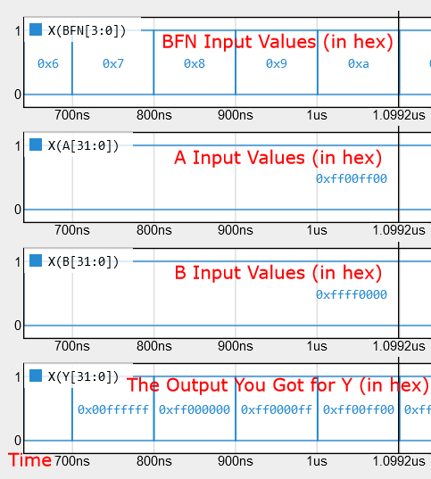